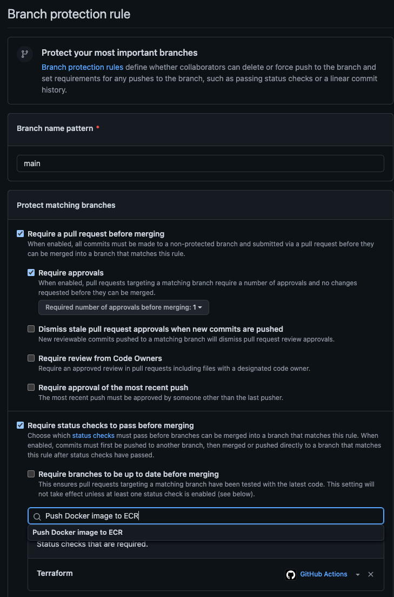

# DevOps-eksamen 2022

### Del 1 DevOps-prinsipper
#### a) Hva er utfordringene med dagens systemutviklingsprosess - og hvordan vil innføring av DevOps kunne være med på å løse disse? Hvilke DevOps prinsipper blir brutt?
<p>
Utfordringen med dagens systemutviklingsprosess er at de har lav frekvens på deployments som betyr at de bruker lang tid på å lansere ny funksjonalitet og endringer. Videre kan det tyde på at har dårlig kvalitetskontroll, da de opplever de mye feil og ustabilitet i produksjon både før og etter at de innførte til mer kontroll og QA.
</p>
<p>
Det er flere DevOps prinsipper som blir brutt. Det er mye waste i verdikjedene som manuelle prosesser som kunne vært automatisert som bygging, testing, deployment og overvåkning. De har også noen unødvendige overleveringer og godkjennelsesprosesser som ikke tilfører verdi. De har store leveranser som kunne brutt ned til mindre størrelser, som bryter med one piece flow prinsippet.
</p>
<p>
Ved å innføre DevOps vil de kunne implementere ny funsjonalitet raskere og med mindre feil. Dette skal jeg forklare nærmer nedenfor.</p>

#### b) En vanlig respons på mange feil under release av ny funksjonalitet er å gjøre det mindre hyppig, og samtidig forsøke å legge på mer kontroll og QA. Hva er problemet med dette ut ifra et DevOps perspektiv, og hva kan være en bedre tilnærming?
<p>
Problemet med dette fra et DevOps-perspektiv er at det kan føre til at utviklingen av ny funksjonalitet tar enda lengre tid samtidig som at kvaliteten blir dårligere. Ved å redusere frekvensen på leveransene, tar det lengre tid å få feedback som gjør vanskeligere å fange opp og løse feil tidlig i utviklingsprosessen. Leveransene blir også større som vil gjøre testing og integrering mer kompleks.
</p>
<p>
En bedre tilnærming hadde vært å implementere prinsipper som kontinuerlig integrasjon og kontinuerlig levering (CI/CD). Dette innebærer å integrere og teste kode ofte og automatisere prosessene for å sikre at endringer kan bli levert raskt og sikkert. På denne måten kan man fange opp og løse feil tidlig, og samtidig øke frekvensen på leveransene.
</p>

#### c) Teamet overleverer kode til en annen avdelng som har ansvar for drift - hva er utfordringen med dette ut ifra et DevOps perspektiv, og hvilke gevinster kan man få ved at team han ansvar for både drift- og utvikling?
<p>
En utfordring med å overlevere kode til en annen avdeling som har ansvar for drift, er at man får to separate team som må koordinere arbeidet. Teamene har gjerne sine egne målsettinger og prioriteringer. På en side har du utviklingsteamet som fokuserer på å utvikle ny funksjonalitet raskt, mens på den andre siden har du driftsavdelingen som fokusere på å sikre stabilitet og oppetid. Dette kan føre til at det tar lengre tid å utvikle og implementere ny funksjonalitet og kan hindre effektiv håndtering av feil og problemer i produksjon.
</p>
<p>
Gevinsten man får ved å ha ett produktteam som har ansvar for både utvikling og drift, er man ha ett team som har en felles og helhetlig forståelse og eierskap av produktet gjennom hele verdikjeden. Dette kan bidra til bedre kodekvalitet, siden teamet er bevisst på hvordan koden vil påvirke systemet i produksjon. Teamet kan raskere implementere ny funksjonalitet og reagere raskere på feil.
</p>

#### d) Å release kode ofte kan også by på utfordringer. Beskriv hvilke- og hvordan vi kan bruke DevOps prinsipper til å redusere eller fjerne risiko ved hyppige leveraner.
<p>
For å redusere eller fjerne risiko ved hyppige leveranser, kan DevOps-prinsipper brukes til å automatisere store deler av prosessen. Dette kan inkludere automatisering av bygging, testing, deployment og overvåkning. Gjennom overvåkning av produksjonsmiljøet, kan man lettere fange opp eventuelle problemer så tidlig som mulig. På denne måten kan man sikre at koden som deployes er stabil og fungerer som forventet. De kan også bruke metoder som feature toggles og canary releases.
</p>


### Del 2 oppgave 3
<p>
Beskrivelse av hvordan man konfigurer branch protection:
</p>

1. Gå til "https://github.com/< githubkonto\>/<repo-navn\>/settings/branch_protection_rules/new" (må fylle inn verdi for githubkonto og repo-navn)
2. Under "Branch name pattern", legg in navnet på branchen det gjelder, som er "main" i dette tilfelle
3. Huk av "Require a pull request before merging" slik at Ingen kan pushe kode direkte på main branch
4. Huk av "Require approvals" så Kode kan merges til main branch ved å lage en Pull request med minst en godkjenning (default er minst en godkjenning, og går til maks seks)
5. Huk av Require status checks to pass before merging, og legg in navnet på jobbene, slik alle jobbene må kjøre grønt før merging

### Del 3 oppgave 1
<p>
Workflowen feiler fordi det brukernavn og Token for autentisering i DockerHub ikke er lagt inn. Docker.yml henter verdiene for brukernavn og Token fra miljøvariablene fra secret.DOCKER_HUB_TOKEN og secret.DOCKER_HUB_USERNAME.
</p>
<p>
For å løse problemet må man:
</p>

1.	Gå inn på https://hub.docker.com/settings/security, og generere ny tilgangs-token
2.	Gå inn på https://github.com/<githubkonto>/<repo-navn>/settings/secrets/actions, og opprett to nye miljøvariabler (new repository secret): DOCKER_HUB_USERNAME og DOCKER_HUB_TOKEN med verdiene henholdsvis DockerHUB-brukernavnet sitt og det nye tilgangs-tokenet generert i step 1.

### Del 3 oppgave 3

<p>
For at sensor skal kunne laste opp container imaget fra sin fork til sitt ECR repo, må han gå inn på docker.yml, og endre på kommandoene "docker tag" og "docker push": skifte ut ECR-navnet til sitt ECR.

</p>
<p>
I det forkede repoet i Gihub må sensor definere to miljøvariabler AWS_ACCESS_KEY_ID og AWS_SECRET_ACCESS_KEY, med verdiene lik key value pairet generet i AWS i AIM/Users/Security, under fanen Security credentials, i felt Access keys
</p>

```
...

docker tag onlinestore-app 244530008913.dkr.ecr.eu-west-1.amazonaws.com/<ECR-navn>:$rev
docker tag onlinestore-app 244530008913.dkr.ecr.eu-west-1.amazonaws.com/<ECR-navn>:latest
docker push 244530008913.dkr.ecr.eu-west-1.amazonaws.com/<ECR-navn>:$rev
docker push 244530008913.dkr.ecr.eu-west-1.amazonaws.com/<ECR-navn>:latest
```
### Del 5 oppgave 1
<p>
En S3 Bucket må ha et globalt unikt navn. Man får derfor en feilmelding hvis man prøver å opprette en bucket med et navn som allerede er i bruk.
</p>
<p>
Terraform prøver å opprette samme bucket hver gang den kjører, fordi den ikke vet at den allerede er opprettet. Årsaken til dette er vi ikke har gitt den en hukommelse(state), som forteller hvilke ressurser som allerede er opprettet
</p>

